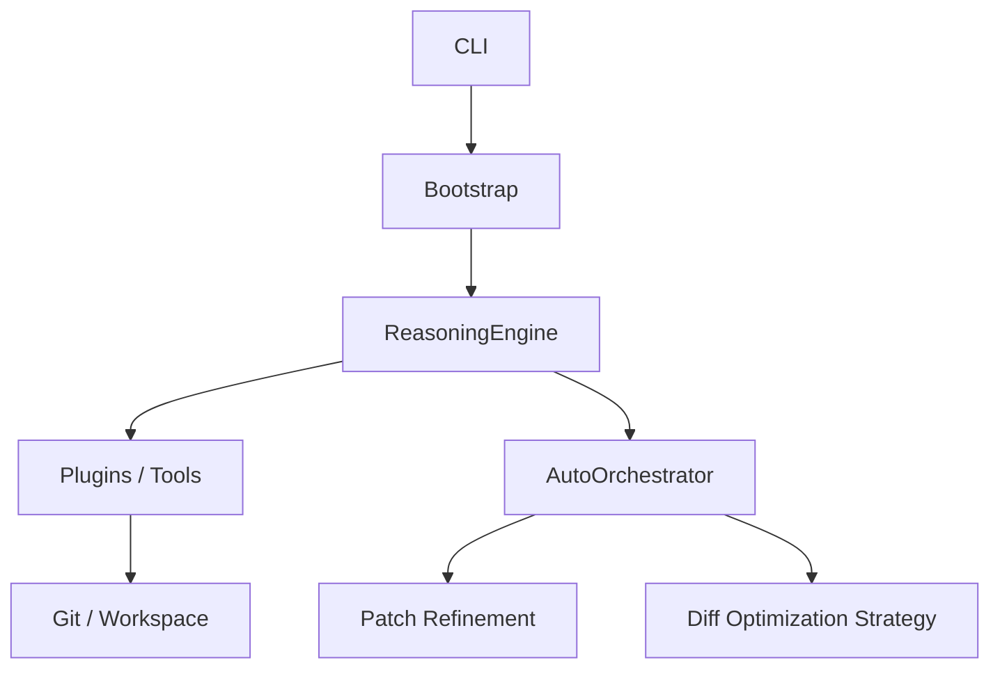

# Architecture Overview

## Modules
- AutoOrchestrator: High-level loop plan -> execute -> refine
- PluginRegistry: Dynamic tool & step handler injection
- Strategies: Extensible reasoning enhancements
