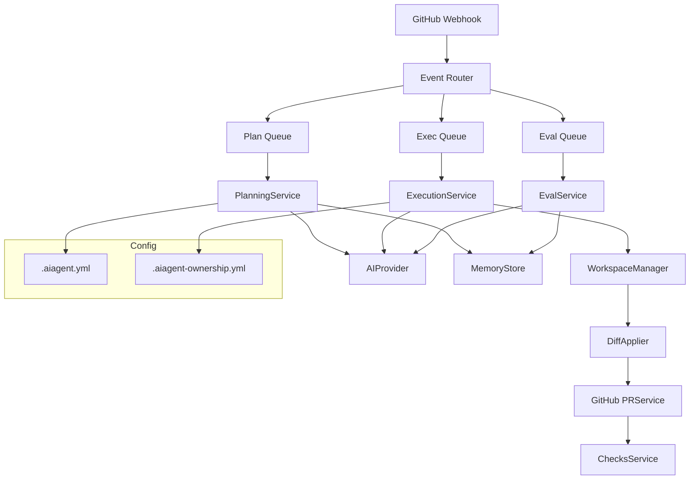

# opis funkcjonalności autonomicznego bota AI do repozytoriów GitHub

---

## 1. Funkcjonalności

Bot jest w pełni autonomicznym agentem AI (AI DevOps Engineer), działającym jako GitHub App, który:

- Reaguje na zdarzenia w repozytorium (issues, issue_comments, pull_requests, push, harmonogram).
- Tworzy plany działania na podstawie zgłoszeń (issues) i kontekstu repo (struktura, historia, kod, konfiguracja).
- Samodzielnie generuje, modyfikuje, przenosi, usuwa pliki/katalogi oraz wprowadza zmiany w kodzie w sposób selektywny (nie nadpisuje bezmyślnie plików).
- Stosuje polityki bezpieczeństwa (np. zmiany tylko w dozwolonych katalogach, branżach, po przejściu testów/unitów/Semgrep).
- Tworzy gałęzie, commituje zmiany, otwiera i aktualizuje Pull Requesty.
- Prowadzi iteracyjną pętlę wykonawczą z adaptacyjną samo-ewaluacją postępów (self-evaluation loop): po każdej iteracji ocenia efekty, generuje nowe zadania lub podzadania, rewiduje plan.
- Komunikuje status, progres i decyzje przez GitHub Checks API, komentarze w PR oraz statusy w issue.
- Pozwala na zaawansowaną kontrolę przez właścicieli repo (pliki .aiagent.yml, .aiagent-ownership.yml, config w panelu App).
- Integruje się z zewnętrznymi providerami AI (OpenAI, GitHub Models, custom) – fallback/round-robin.
- Ma własną pamięć długoterminową (embedding index) do uczenia się na bazie historii repo i issue.
- Może wykonywać testy, analizy Semgrep, analizę pokrycia (coverage), a w razie błędów – automatycznie wycofać nieudane zmiany.
- Reaguje na komendy przez komentarze w PR (np. @ai-bot plan|run|stop|status).
- Samodzielnie wykrywa i naprawia luki w pokryciu planu, dzieli duże zadania na podzadania, re-planifikuje gdy pojawią się nowe zależności lub ryzyka.

---

## 2. Przykładowe przepływy działania

### A. Flow: Automatyczna obsługa zgłoszenia funkcjonalności (issue)

1. Użytkownik tworzy issue z opisem nowej funkcji.
2. Bot rozpoznaje nowe issue i pobiera kontekst repo (drzewo plików, historię, config .aiagent.yml).
3. Generuje plan działania (tasks) w formie plan.md oraz YAML (ze strukturalnymi zależnościami i typami zadań).
4. Tworzy nową gałąź (np. ai/issue-123-agent), commituje plan i otwiera draft PR.
5. Iteracyjnie realizuje zadania:
   - Pobiera i analizuje aktualny kod oraz testy.
   - Generuje patch (unified diff), stosuje i commit-uje.
   - Uruchamia testy, Semgrep, pokrycie.
   - Po sukcesie, aktualizuje PR, statusy, komentarze.
   - Po wykonaniu wszystkich tasks: uruchamia samo-ewaluację (czy wymagania pokryte, czy są luki?).
   - Jeśli są braki: tworzy nowe tasks/podzadania, kontynuuje cykl.
   - Gdy AI uzna, że wszystko zrobione, zamyka pętlę i oznacza PR jako gotowy.
6. Po merge PR: bot podsumowuje działania, archiwizuje trace reasoning, aktualizuje embedding/memory store.

### B. Flow: Samo-wykrywanie niepełnej realizacji

- Po zakończeniu wszystkich tasks, bot uruchamia evaluation (LLM ocenia stan repo, pokrycie issue).
- Jeśli LLM wykryje braki (np. brak testów, niepełna funkcjonalność, dług techniczny), bot automatycznie generuje i dodaje nowe tasks do planu, aktualizuje plan.md i przechodzi kolejną iterację.

### C. Flow: Adaptacyjne podzadania i komendy sterujące

- W trakcie realizacji dużego taska bot może sam zdecydować o jego rozbiciu na kilka mniejszych subtasks (np. “Implement API endpoint” → “Zdefiniuj model”, “Dodaj route”, “Napisz testy”).
- Bot zamieszcza komentarze w PR w specjalnym formacie (np. <!-- AI-CONTROL: { action: "pause", reason: "..."} -->), które samodzielnie interpretuje i wywołuje odpowiednie działania.

### D. Flow: Ochrona jakości i bezpieczeństwa

- Przed każdym commitem patch jest walidowany:
   - Czy zmienia tylko wybrany fragment pliku?
   - Czy nie usuwa nadmiarowo kodu?
   - Czy nie dotyka plików zastrzeżonych przez .aiagent-ownership.yml?
   - Czy nie powoduje regresji w testach / Semgrep?
- Jeśli patch nie przejdzie walidacji, jest automatycznie refinowany lub pomijany, a task oznaczony jako “blocked”.

---

## 3. Opis architektury

### A. Warstwa eventów i webhooków

- Webhooki GitHub App: issues, issue_comment, pull_request, push, check_suite/run, harmonogram (cron).
- Queue (np. BullMQ/Redis): kolejkowanie jobs (plan, exec, eval, sweep).

### B. Core Service Layer

- **IssueAgentService**: rejestracja i utrzymanie stanu agentów per issue.
- **PlanningService**: generowanie planu, ekstrakcja tasks.
- **ExecutionService**: iteracyjne wykonywanie tasks, obsługa commitów.
- **EvalService**: samo-ewaluacja, generowanie nowych zadań/podzadań.
- **PRService**: obsługa gałęzi, PR, statusów.
- **PatchLogService**: archiwizacja i śledzenie patchy.

### C. Warstwa reasoning & memory

- **ReasoningEngine**: orchestruje planowanie, patchowanie, ewaluację.
- **MemoryStore**: długoterminowa baza embeddingów (historyczne issue, kod, plany, trace).
- **ContextWindowManager**: zarządzanie kontekstem dla LLM, trimming, selekcja plików do promptu.

### D. AI Provider Abstraction

- **AIProvider**: interfejs do backendów LLM (OpenAI, GitHub Models, custom).
- **PromptTemplates**: zaawansowane szablony promptów z wymuszaniem formatów odpowiedzi (JSON, diff, YAML).

### E. Warstwa Git/Patch/Workspace

- **WorkspaceManager**: zarządzanie klonowaniem, stagingiem, commitami, push.
- **DiffApplier**: parser i aplikator diff (unified), heurystyki minimal-change.
- **AST Refiner**: dla JS/TS – refaktoryzacja i walidacja na poziomie AST.

### F. Checks/Status/Policy

- **ChecksService**: wystawianie check runs (ai-plan, ai-exec, ai-eval, ai-security, ai-complete).
- **PolicyEngine**: egzekwowanie polityk (ownership, gating, testy, Semgrep).

### G. Konfiguracja

- **.aiagent.yml**: konfiguracja repo (modele, limity, polityki, patterny skip).
- **.aiagent-ownership.yml**: polityka własności katalogów/plików.
- **Panel instalacji**: konfiguracja providerów, kluczy, limitów adaptacyjnych.

---

## 4. Przykładowa architektura (schemat)



---

## 5. Kluczowe cechy wyróżniające

- Pełna autonomia: bot sam analizuje, planuje, wykonuje i ewoluuje działania bez udziału człowieka.
- Adaptacyjność: dynamicznie zmienia plan, dzieli zadania, rewiduje decyzje.
- Selektowność zmian: nie nadpisuje bezmyślnie kodu, stosuje hunki, heurystyki minimalnych zmian.
- Self-evaluation: cykliczna auto-weryfikacja, generacja nowych tasks, zamykanie pętli tylko po pełnej pokryciu wymagań.
- Bezpieczeństwo: polityki, testy, Semgrep, ownership gating.
- Rozszerzalność: wsparcie dla nowych providerów, custom promptów, pluginów, narzędzi (np. test runner, Semgrep).
- Pamięć długoterminowa: uczenie się na bazie historii repo i issue, embeddowanie trace reasoning.

---

## 6. Przykład komunikacji i interakcji

- PR:  
  - Komentarz bota:  
    ```
    <!-- AI-CONTROL: { "action": "pause", "reason": "awaiting review", "taskId": "T3" } -->
    ```
  - Status:  
    - ai-plan: success
    - ai-exec: in_progress
    - ai-eval: blocked
    - ai-complete: pending
- Issue:
  - Komentarz:  
    ```
    Plan v2: tasks expanded after self-evaluation. See plan.md for details.
    ```
- .aiagent.yml:
  ```yaml
  provider: github_models
  max_iter: 8
  restrict_paths:
    - "src/*"
    - "!src/experimental/"
  test_command: "npm run test"
  semgrep_policy: "block_high_severity"
  ```

---

# Podsumowanie

Bot osiąga poziom “AI Software Engineer-as-a-Service” dla repozytoriów GitHub, samodzielnie rozwijając, poprawiając i chroniąc jakość kodu na podstawie zgłoszeń, polityk i własnej wiedzy. Jego architektura umożliwia pełny cykl DevOps: od planu, przez development, testy, aż po ewaluację i utrzymanie.
